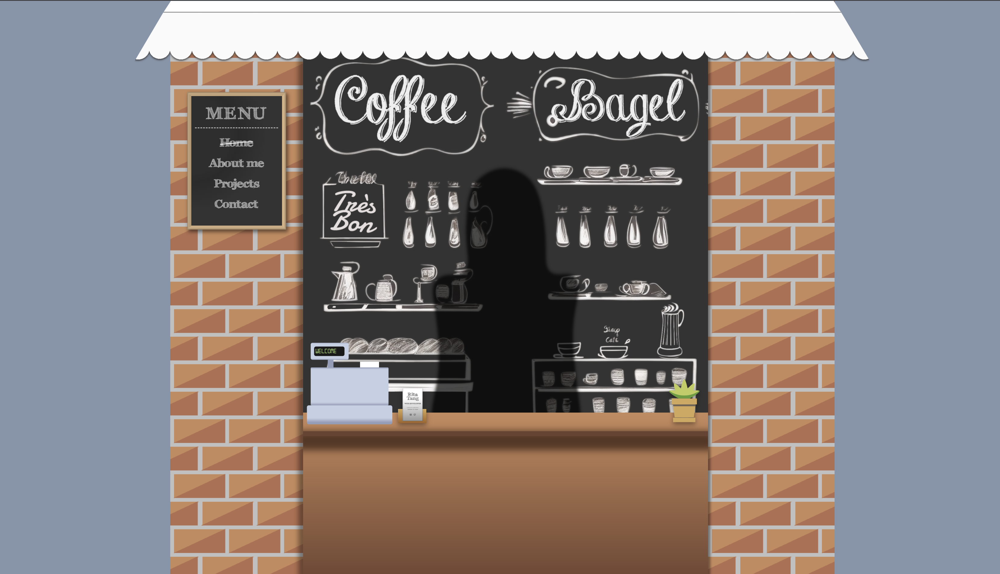

# Rita Tang's Portfolio

Welcome to the repository of my portfolio website! This repository contains the source code and assets for the front-end of my personal portfolio website. To access the code for the back-end portion of the website, please refer to the [portfolio backend repository](https://github.com/ritatanght/portfolio-backend).

[Live Site](https://ritatang.vercel.app/)

## Features

**About Me**
- Learn about my background, skills, and passion for web development.

**Projects**
- Browse through a collection of my recent projects, each demonstrating various aspects of web development, including front-end design and back-end functionality. 
- Utilize Express and MongoDB to retrieve project data. A POST route has also been implemented for easy database updates with new projects. Since adding new projects is done exclusively by me, there is no front-end interface for it. Nonetheless, for security reasons, authentication information is required for any such actions.

**Contact**
- Connect with me through the contact form or reach out to me via the provided social media links. 

## Build With

- HTML
- Sass
- React
- Express
- MongoDB
- Emailjs
- Vercel (for hosting)

## Contact

For any inquiries or collaboration opportunities, please reach out to me through the contact form on my portfolio website or connect with me on LinkedIn.
